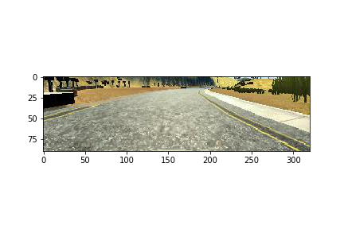

# **Behavioral Cloning** 

**Behavioral Cloning Project**

The goals / steps of this project are the following:
* Use the simulator to collect data of good driving behavior
* Build, a convolution neural network in Keras that predicts steering angles from images
* Train and validate the model with a training and validation set
* Test that the model successfully drives around track one without leaving the road
* Summarize the results with a written report


[//]: # (Image References)

[image1]: ./examples/placeholder.png "Model Visualization"
[image2]: ./examples/placeholder.png "Grayscaling"
[image3]: ./examples/placeholder_small.png "Recovery Image"
[image4]: ./examples/placeholder_small.png "Recovery Image"
[image5]: ./examples/placeholder_small.png "Recovery Image"
[image6]: ./examples/placeholder_small.png "Normal Image"
[image7]: ./examples/placeholder_small.png "Flipped Image"
[regression_auto]: ./images/regression_auto.png "regression model running on simulator"
[lenet_auto1]: ./images/lenet_auto1.png "lenet running on simulator 1"
[lenet_auto2]: ./images/lenet_auto2.png "lenet running on simulator 2"


## Rubric Points
### Here I will consider the [rubric points](https://review.udacity.com/#!/rubrics/432/view) individually and describe how I addressed each point in my implementation.  

---
### Files Submitted & Code Quality

#### 1. Submission includes all required files and can be used to run the simulator in autonomous mode

My project includes the following files:
* data.py containing the script to generate the data
    * **Note:** The data have several parts since they are processed differently for center lane data and, left or right side lane data (train to not run off the road) 
* model.py containing the script to create and train the model
* drive.py for driving the car in autonomous mode
* model.h5 containing a trained convolution neural network 
* writeup.md summarizing the results
* run1.mp4 recording the results

#### 2. Submission includes functional code
Using the Udacity provided simulator and my drive.py file, the car can be driven autonomously around the track by executing 
```sh
python drive.py model.h5
```

#### 3. Submission code is usable and readable

The model.py file contains the code for training and saving the convolution neural network. The file shows the pipeline I used for training and validating the model, and it contains comments to explain how the code works.


### Model Architecture and Training Strategy

#### 1. Solution Design Approach

The overall strategy for deriving a model architecture was as following:

Some shared structure
    * Objective: mean square error
    * Optimzer: adam
    * Testing data: 20%

1. A simple regression model by flattening the input
    * **start data: two laps with couterclockwise direction on the track 1**
    * The training error is around 2000, the testing error is around 1700
    * The training start ocilliate around epoch 5
    * **Simulator**: car runs immediately off the road with a sharp turn to the left 

2. Same architecture as previous, but with **normalization**
    * **Add training data from the two laps data driving clockwise on the track 1**
    * Training data shape **(6575, 160, 320, 3)**
    * The training error drops dramastically to 1.7713, the testing error is around 1.8564
    * The traiing error drops to the minumum at epoch 2, so nb_epoch is set to 2
    * **Simulator**: drove a very short distance, then ran off the road as following

```python
model.add(Lambda(lambda x: x / 255.0 - 0.5, input_shape=(160, 320, 3)))
```


3. Original LeNet
    * conv->relu->pooling->conv->relu->pooling->fc->fc->fc(1) 
    * Training erros stops around 0.5, the testing error is around 0.7
    * Training seems costly and overfitting.
    * Parameter seems too much, since there are three fully connected layer in orignal LeNet network
    * **Simulator**: drove off the road after a short distance, it seems worse than model 2
    * **Note:** we are using **mse**, error 0.7 means average angle error is around 0.8, that still seems large value. One big error might leads to off the road and never come back.

4. Add one more convolutional layer to LeNet and remove two fully connected layer
    * conv->relu->pooling->conv->relu->pooling->conv->relu->pooling->fc(1)
    * Training errors achive minimum around 0.03 and testing error is around 0.03
    * **Simulator:** ran relatively good and drove off the road at the first big turn
    * **Should collect data that teach how to drive back to the lane**
    * **more image processing** and **data augmentation**

  

5. Augment dataset by flipping the image and corresponding measurement
    * Training errors achive minimum around 0.0218 and testing error is around 0.0314 setting nb_epochs = 5
    * The validation error is increasing after first epoch, so next decrease nb_epochs = 2. Then training error = 0.0261, validation error = 0.0268. 
        * **This is very strange, it seems that error is not aligned with performances**. Overfitting/bad generalization?
        * One possible explannation is: One big mistakes will fail car to the center lane. Though both errors are small, there might be case that it will make one big mistake
    * **Simulator:** 1) both nb_epochs = 5 or 2, it actually run worse than model 4, 

    

5. Augment dataset by using the left and right camera
    * The angle correction are set as 0.2 for left and -0.2 for right
    * training loss: 0.0261 and validation error 0.0268
    * **Simulator:** 1) Almost finish the lap 2) fail on some points
    * Figure 1 is at the very begining of the trail. Most models fail at the very begining which actually is counter-intuitive. In my opinion, it fails because that at the very begining, the road is too straight and the training data contains most images with 0 angles in which case it equals to have no training data.

    
    
    
6. To train the model turning back into center
    * Add training data by driving the car close to the left or right sides
    * For driving in the left side, I only consider the left and center images, and add a correction 0.4 for center image and 0.6 to left image
    * For driving in the right side, I only consider the right and center images, and a correction -0.4 for center image and -0.6 to right image
    * training loss: 0.0346 and validation error 0.0341
        * Add droput layers to better generalize
        * training loss: 0.0316 and validation error 0.0299
    * **Simulator: SUCCESS**

<video width="960" height="540" controls><source src="run1.mp4"></video>

#### 2. Final Model Architecture

The final model architecture (model.py lines 18-24) consisted of a convolution neural network with the following layers and layer sizes

```python

model = Sequential()
model.add(Cropping2D(cropping=((50, 20), (0, 0)),
                     input_shape=(160, 320, 3)))
model.add(Lambda(lambda x: x / 127.5 - 1.))
model.add(Convolution2D(6, 5, 5))
# model.add(Convolution2D(6, 5, 5, input_shape=(160, 320, 3)))
model.add(Activation('relu'))
model.add(MaxPooling2D(pool_size=(2, 2)))  # default (2, 2)

model.add(Convolution2D(6, 5, 5,))
model.add(Activation('relu'))
model.add(MaxPooling2D(pool_size=(2, 2)))  # default (2, 2)

model.add(Convolution2D(6, 5, 5,))
model.add(Activation('relu'))
model.add(MaxPooling2D(pool_size=(2, 2)))  # default (2, 2)

model.add(Flatten())
model.add(Dropout(0.2))
model.add(Dense(120, activation="relu"))
model.add(Dropout(0.2))
model.add(Dense(84, activation="relu"))
model.add(Dense(1))

```


#### 3. Creation of the Training Set & Training Process

* To capture good driving behavior, I first recorded four laps on track one using center lane driving, two running counter-clockwise and two running clockwise. Here is an example showing images for driving counter-clockwise for left, center and right camera respectively:

    

Here is an example showing images for driving clockwise for left, center and right camera respectively:

    

* To augment the data sat, I also flipped images and angles thinking that this would enrich the dataset as it is like driving the opposite direction as it really is. Furthermore, to avoid distraction from irrevalent informations such trees and sky, we cropped the data. Following is three images showing in its original, flipped, cropped version:

    

* To let the vehicle learn to recover from sides of road back, I then recorded the vehicle driving along the left or right sides. For driving along right sides, I only consider center and right images, and add a correction of -0.4 and -0.6 respectively. Following is one set of images (left, center, right) driving along the right side:

    

For driving along left sides, I only consider left and center images, and add a correction of 0.4 and 0.6 respectively. Following is one set of images (left, center, right) driving along the left side:

    


After the collection process, I had 41367 number of data points (Doubled after flipping the image). I then preprocessed this data by normalization and cropping

```python
model.add(Cropping2D(cropping=((50, 20), (0, 0)),
                     input_shape=(160, 320, 3)))
model.add(Lambda(lambda x: x / 127.5 - 1.))
```

I finally randomly shuffled the data set and put 20% of the data into a validation set. 

I used this training data for training the model. The validation set helped determine if the model was over or under fitting. The ideal number of epochs was 2 as evidenced by that it achives the minumum training error and validation error is aligned with traiing error. I used an adam optimizer so that manually training the learning rate wasn't necessary.
